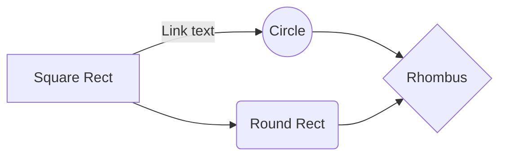
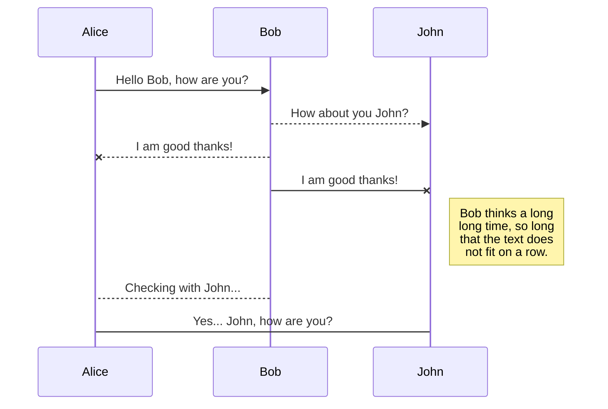
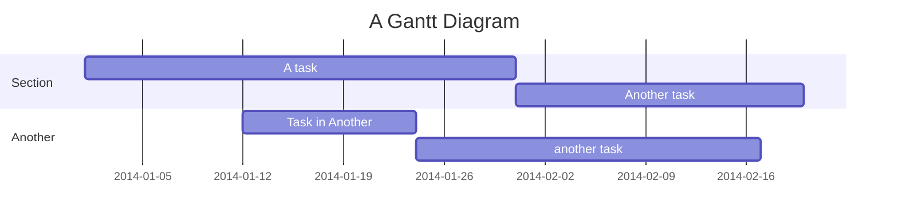
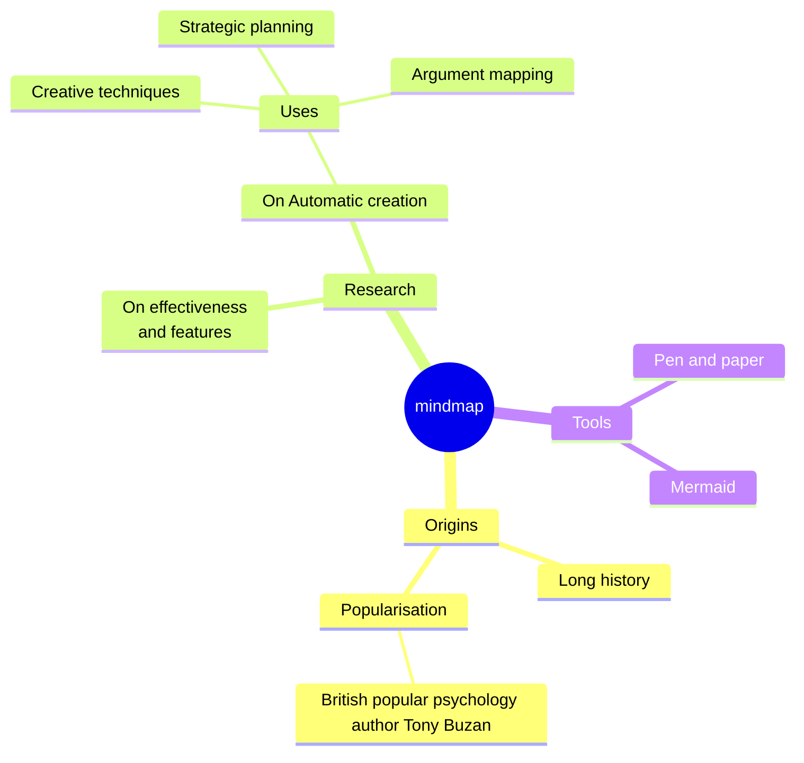

# Example (H1)

This is a simple demo page to show the capabilities of using Markdown to write documentation and using Mermaid to render diagrams.

## Markdown (H2)

Markdown is a lightweight markup language with plain text formatting syntax and provides a simple yet powerful way to format text.
It is widely used in documentation, readme files, and various other applications.
Below are some of the key features of Markdown.

More information on Markdown can be found in the [Markdown Guide](https://www.markdownguide.org/).

### 1. Headers (H3)

#### This is an H4

##### This is an H5

###### This is an H6

### 2. Emphasis

_This text will be italic_  
**This text will be bold**  
**_This text will be both italic and bold_**

### 3. Lists

#### Unordered List

- Item 1
- Item 2
  - Subitem 2.1
  - Subitem 2.2
- Item 3

#### Ordered List

1. First item
2. Second item
3. Third item

### 4. Links

- [Internal link](./index.md)
- [External link](https://refarch.oss.muenchen.de)

### 5. Images


### 6. Blockquotes

> This is a blockquote.
>
> - It can span multiple paragraphs.
> - It can also have lists.

### 7. Code

#### Inline Code

This is some `inline code`.

#### Code Blocks

```python
def hello_world():
    print("Hello, World!")
```

### 8. Horizontal Rule

---

### 9. Tables

| Header 1 | Header 2 | Header 3 |
| -------- | -------- | -------- |
| Row 1    | Data 1   | Data 2   |
| Row 2    | Data 3   | Data 4   |

## Vitepress-specific Markdown Extensions

Vitepress provides additional extensions to the Markdown language.
Below are some examples of the extensions.

For more information visit the corresponding [Vitepress Markdown Extension documentation](https://vitepress.dev/guide/markdown)

### 1. GitHub Style Tables

| Tables        |      Are      |  Cool |
| ------------- | :-----------: | ----: |
| col 3 is      | right-aligned | $1600 |
| col 2 is      |   centered    |   $12 |
| zebra stripes |   are neat    |    $1 |

### 2. Emojis

:tada: :100:

### 3. Containers

::: info
This is an info box.
:::

::: tip
This is a tip.
:::

::: warning
This is a warning.
:::

::: danger THIS IS A CUSTOM TITLE
This is a dangerous warning.
:::

::: details
This is a details block.
:::

## Mermaid

Mermaid is a JavaScript based diagramming and charting tool that renders Markdown-inspired text definitions.
Below are some examples of using Mermaid with Vitepress.

More information on Mermaid can be found in its [official documentation](https://mermaid.js.org/)
The Vitepress integration for Mermaid is possible via the [Vitepress Plugin Mermaid](https://emersonbottero.github.io/vitepress-plugin-mermaid/).

### 1. Flow Chart



### 2. Sequence Diagram



### 3. Gantt Diagram



### 4. Mindmap


